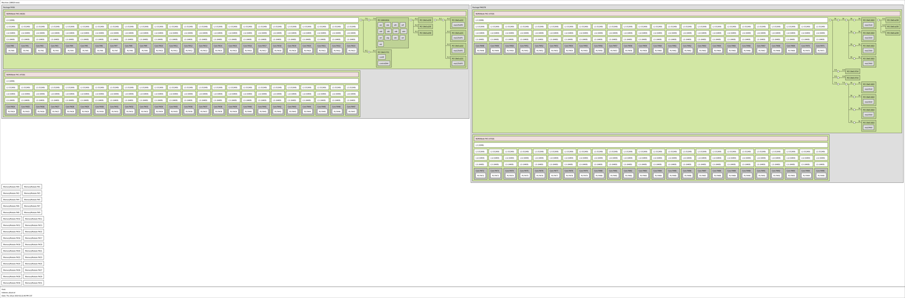

**********************************
对比Intel和Kunpeng处理器
**********************************

简单对比
===============

.. csv-table::
   :header: 项目, Intel, kunpeng
   :widths: 30, 20, 20

   架构,        x86/x64,  aarch64
   比特,        32位/64位,     64位
   指令集类型,   CISC,     RISC
   指令集厂家,   Intel,    ARM
   CPU厂家,     Intel,    华为海思

lscpu
====================================
lscpu可以列出CPU的详细信息。选取以下服务器：

==================== =========================================
服务器型号           CPU型号
==================== =========================================
泰山 TaiShan 2280 V2 Kunpeng 920-4826
戴尔 PowerEdge R730  Intel(R) Xeon(R) CPU E5-2630 v4 @ 2.20GHz
==================== =========================================

鲲鹏 920
----------------------------

.. code-block:: console

   Architecture:          aarch64          #ARM64架构
   Byte Order:            Little Endian    #小端
   CPU(s):                96               #cpu数量96核
   On-line CPU(s) list:   0-95             #cpu的编号
   Thread(s) per core:    1                #单线程， 不支持超线程
   Core(s) per socket:    48               #每个物理核的core数量
   Socket(s):             2                #一共有两个物理CPU
   NUMA node(s):          4                #numa节点
   Model:                 0
   BogoMIPS:              200.00
   L1d cache:             64K              #L1 data cache 数据cache
   L1i cache:             64K              #L1 instruction cache 指令cache
   L2 cache:              512K             #L2 cache
   L3 cache:              32768K           #L3 cache
   NUMA node0 CPU(s):     0-23             #numa节点1的CPU
   NUMA node1 CPU(s):     24-47            #numa节点2的CPU
   NUMA node2 CPU(s):     48-71            #numa节点3的CPU
   NUMA node3 CPU(s):     72-95            #numa节点4的CPU
   Flags:                 fp asimd evtstrm aes pmull sha1 sha2 crc32 atomics fphp
                          asimdhp cpuid asimdrdm jscvt fcma dcpop

Intel(R) Xeon(R) CPU E5-2630
--------------------------------------------------

.. code-block:: console

   Architecture:          x86_64           #X86架构
   CPU op-mode(s):        32-bit, 64-bit   #同时支持32位和64位运行模式
   Byte Order:            Little Endian    #小端系统
   CPU(s):                40               #cpu数量40
   On-line CPU(s) list:   0-39             #cpu的编号
   Thread(s) per core:    2                #超线程数量，一般情况下
                  CPUs 40 = Thread(s) per core × Core(s) per socket × Socket(s)
   Core(s) per socket:    10               #每个物理核的core数量
   Socket(s):             2                #一共有两个物理CPU。
   NUMA node(s):          2                #两个numa节点
   Vendor ID:             GenuineIntel
   CPU family:            6
   Model:                 79
   Model name:            Intel(R) Xeon(R) CPU E5-2630 v4 @ 2.20GHz #主频2.2GHz
   Stepping:              1
   CPU MHz:               1720.227
   CPU max MHz:           3100.0000        #超频
   CPU min MHz:           1200.0000        #降频
   BogoMIPS:              4400.03
   Virtualization:        VT-x             #支持超线程技术
   L1d cache:             32K              #L1 data cache 数据cache
   L1i cache:             32K              #L1 instruction cache 指令cache
   L2 cache:              256K             #L2 cache
   L3 cache:              25600K           #L3 cache
   NUMA node0 CPU(s):     0,2,4,6,8,10,12,14,16,18,20,22,24,26,28,30,32,34,36,38 #numa节点1的CPU
   NUMA node1 CPU(s):     1,3,5,7,9,11,13,15,17,19,21,23,25,27,29,31,33,35,37,39 #numa节点1的CPU
   Flags:                 fpu vme de pse tsc msr pae mce cx8 apic sep mtrr pge
                          mca cmov pat pse36 clflush dts acpi mmx fxsr sse sse2
                          ss ht tm pbe syscall nx pdpe1gb rdtscp lm constant_tsc
                          arch_perfmon pebs bts rep_good nopl xtopology
                          nonstop_tsc aperfmperf eagerfpu pni pclmulqdq dtes64
                          monitor ds_cpl vmx smx est tm2 ssse3 sdbg fma cx16 xtpr
                          pdcm pcid dca sse4_1 sse4_2 x2apic movbe popcnt
                          tsc_deadline_timer aes xsave avx f16c rdrand lahf_lm
                          abm 3dnowprefetch epb cat_l3 cdp_l3 intel_pt ibrs ibpb
                          stibp tpr_shadow vnmi flexpriority ept vpid fsgsbase
                          tsc_adjust bmi1 hle avx2 smep bmi2 erms invpcid rtm
                          cqm rdt_a rdseed adx smap xsaveopt cqm_llc
                          cqm_occup_llc cqm_mbm_total cqm_mbm_local dtherm ida
                          arat pln pts spec_ctrl intel_stibp

NUMA架构
===============

NUMA架构，非统一内存访问架构（英语：Non-uniform memory access，简称NUMA）。

在numa出现之前， cpu通过内存控制器访问内存，显然，当cpu核数逐渐增多的今天，内存控制器会成为瓶颈。
这个时候就考虑内存控制器进行拆分内存平均分配到各个die上，cpu访问本地的内存时速度快，跨片访问慢。
类似与这个图：

|numa示意|

实际上，这个图的数据来自numactl工具的输出：

.. code-block:: console

  Kunpeng                  │    intel
                           │
  node distances:          │    node distances:
  node   0   1   2   3     │    node   0   1
    0:  10  16  32  33     │      0:  10  21
    1:  16  10  25  32     │      1:  21  10
    2:  32  25  10  16     │
    3:  33  32  16  10     │

在做性能优化时，针对numa结构的绑核可以让数据访问更快。比如网络性能测试，需要频繁从
网络收发数据， 这个时候测试程序和网卡在同一个numa节点上时，性能最好； 需要频繁将收来的数据
写入硬盘有时候也经常会被问硬盘是在哪个numa节点上的，网卡是在哪个numa节点上的，中断怎么绑定
效率最高，下面展开了解一下。

这里以lstopo的输出作为对比

鲲鹏 920-4826
--------------------------

.. literalinclude:: ./kunpeng_lstopo.txt
   :lines: 1-10
   :language: console

Machine (188GB total)
  主机188GB内存。 可以用free -g命令进行确认

Package L#0
  独立的物理CPU封装， 这台服务器上有4826有两个CPU。 整个服务器一共64核

NUMANode L#0 (P#0 46GB)
  numa node 0，有46G直连内存。暂时不明白为什么不是47GB，后续的其他node是47.
  全部内容可以查看附件 :ref:`kunpeng_lstop`

L3 L#0 (32MB)
  node0 的L3 cache
  全部内容可以查看附件 :ref:`kunpeng_lstop`

L2 L#0 (512KB) + L1d L#0 (64KB) + L1i L#0 (64KB) + Core L#0 + PU L#0 (P#0)
  + L2 L#0 (512KB)表示node0下第一个L2 cache 512KB。
  + L1d L#0 (64KB)表示L1 Data Cache 64KB
  + L1i L#0 (64KB)表示L1 Instruction Cache 64KB
  + Core L#0 表示第0个物理核
  + PU L#0 (P#0)表示Processing Unit Processor 第0个cpu核心

------------

.. literalinclude:: ./kunpeng_lstopo.txt
   :lines: 29-35
   :language: console

HostBridge L#0
  表示主桥0

PCI 1000:0016
  表示PCI号，查看pci设备可以使用命令 `lspci -nn | grep 1000:0016` 例如查看1822网卡

  .. code-block:: console

    [root@ARM server home]# lspci -nn | grep 19e5:1822
    83:00.0 Ethernet controller [0200]: Huawei Technologies Co., Ltd. Hi1822 Family (4*25GE) [19e5:1822] (rev 45)
    84:00.0 Ethernet controller [0200]: Huawei Technologies Co., Ltd. Hi1822 Family (4*25GE) [19e5:1822] (rev 45)
    85:00.0 Ethernet controller [0200]: Huawei Technologies Co., Ltd. Hi1822 Family (4*25GE) [19e5:1822] (rev 45)
    86:00.0 Ethernet controller [0200]: Huawei Technologies Co., Ltd. Hi1822 Family (4*25GE) [19e5:1822] (rev 45)

Block(Disk) L#0 "sdj"
  表示node0上的第一个机械硬盘，一次类推，可以看到后面有多个

------------

.. literalinclude:: ./kunpeng_lstopo.txt
   :lines: 54-62
   :language: console

这些是板载网卡的四个口

------------

.. literalinclude:: ./kunpeng_lstopo.txt
    :lines: 177-179
    :language: console

这些是内存条物理插槽数量

同时我们也可以直接查看比较直观的拓扑图：

|lstopo|

Intel(R) Xeon(R) CPU E5-2630
-------------------------------------------------

.. literalinclude:: ./intel_lstopo.txt
    :lines: 1-7
    :language: console

Machine (128GB total)
  设备一共128G内存

NUMANode L#0 (P#0 64GB)
  第0个numa节点， 可以看到一共两个numa节点。全部内容可以查看附件 :ref:`intel_lstopo`
Package L#0 + L3 L#0 (25MB)
  表示L3 cache 25MB

L2 L#0 (256KB) + L1d L#0 (32KB) + L1i L#0 (32KB) + Core L#0
  + L2 L#0 (256KB)表示第0个L2 cache 256KB， 这个node上一共有10个
  + L1d L#0 (32KB)表示L1 data cache 32KB
  + L1i L#0 (32KB)表示L1 Instruction cache 32KB
  + Core L#0表示第0个物理核心
  + PU L#0 (P#0) 表示Processing Unit Processor 第0个cpu核心
  + PU L#1 (P#20) 表示Processing Unit Processor 第20个cpu核心
  + 这里注意，这里是一个物理核的两个线程， 一个线程能代表一个cpu核心

------------

.. literalinclude:: ./intel_lstopo.txt
    :lines: 36-38
    :language: console

这里是node 0下的两个机械硬盘

------------

.. literalinclude:: ./intel_lstopo.txt
    :lines: 39-42
    :language: console

这里是node 0下的一个网卡的两个端口

同时我们也可以直接查看比较直观的拓扑图：

| |image2|

网卡在哪个numa节点上？
--------------------------------------

从上面的输出我们是可以看出来的， 但是有时候我们需要一个更直接一点的方式。

其实我们完全可以直接查询网卡上的某个端口在哪个numa节点上

.. code-block:: console

  [user1@centos ~]$ cat /sys/class/net/enp125s0f1/device/numa_node
  0
  [user1@centos ~]$ cat /sys/class/net/enp189s0f2/device/numa_node
  2

硬盘在哪个numa节点上？
--------------------------------------

首先找到硬盘在哪个pci设备上。

.. code-block:: console

  [user1@centos block]$ ls -l /dev/disk/by-path/
  total 0
  lrwxrwxrwx. 1 root root  9 Jan 21 15:55 pci-0000:74:02.0-sas-0x5d0efc1ff03b3000-lun-0 -> ../../sda

然后查找pci设备的numa node

.. code-block:: console

  [user1@centos by-path]$ cat /sys/bus/pci/devices/0000\:74\:02.0/numa_node
  0

附件
========

.. _kunpeng_lstop:

Kunpeng lstopo
---------------------

.. literalinclude:: ./kunpeng_lstopo.txt
  :language: console

.. _intel_lstopo:

Intel lstopo
--------------------

.. literalinclude:: ./intel_lstopo.txt
  :language: console

.. |image2| image:: _static/images/dell.png

