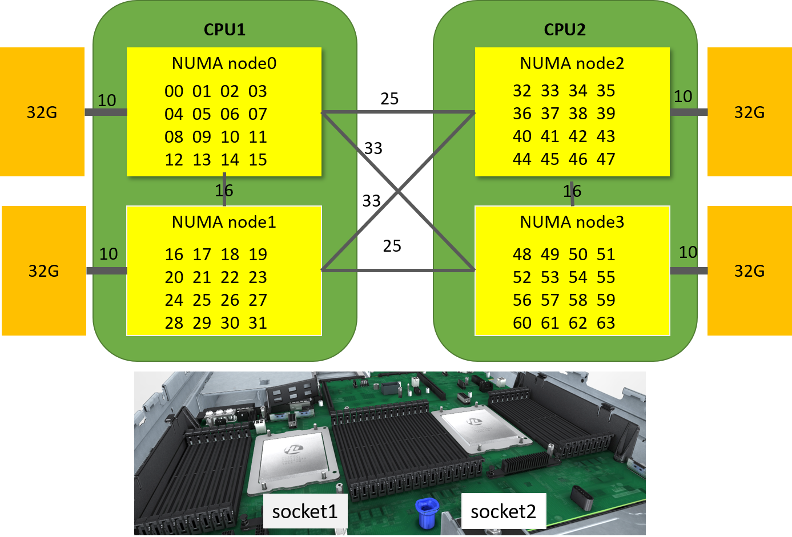
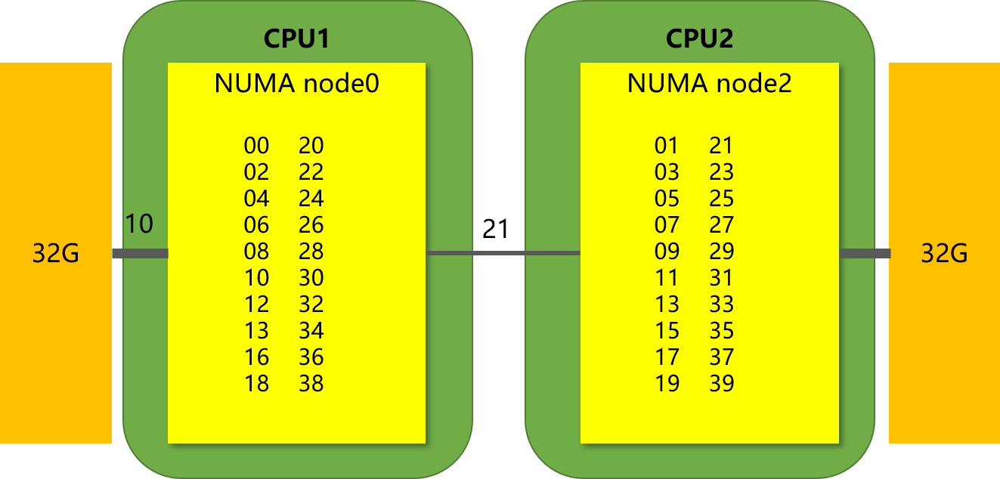
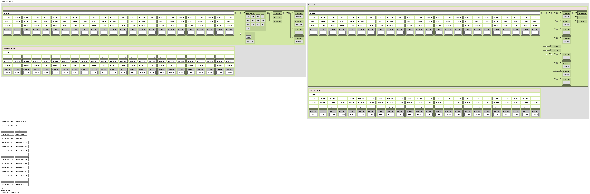
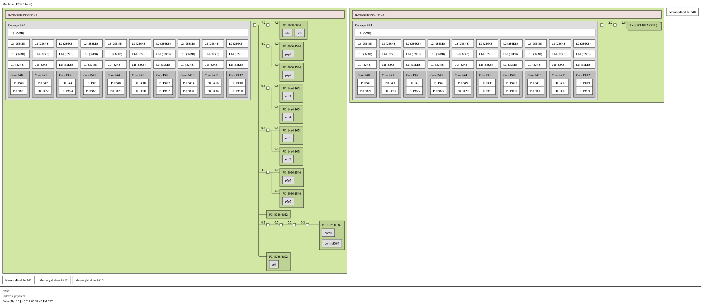

*****************
对比NUMA架构
*****************

NUMA架构，非统一内存访问架构（英语：Non-uniform memory access，简称NUMA）。

在numa出现之前， cpu通过内存控制器访问内存，显然，当cpu核数逐渐增多的今天，内存控制器会成为瓶颈。
这个时候就考虑内存控制器进行拆分内存平均分配到各个node上，cpu访问本地的内存时速度快，跨片访问慢。

NUMA 距离
================

的数据来自numactl工具的输出：

.. code-block:: console

  Kunpeng 920              │    Intel E5-2630
                           │
  node distances:          │    node distances:
  node   0   1   2   3     │    node   0   1
    0:  10  16  32  33     │      0:  10  21
    1:  16  10  25  32     │      1:  21  10
    2:  32  25  10  16     │
    3:  33  32  16  10     │

先给出他们距离的示意图：

Kunpeng 920：
|numa_kunpeng|

Intel E5-2630：
|numa_intel|

在做性能优化时，针对numa结构的绑核可以让数据访问更快。比如网络性能测试，需要频繁从
网络收发数据， 这个时候测试程序和网卡在同一个numa节点上时，性能最好； 需要频繁将收来的数据
写入硬盘有时候也经常会被问硬盘是在哪个numa节点上的，网卡是在哪个numa节点上的，中断怎么绑定
效率最高，下面展开了解一下。lstopo给出了详细的说cpu拓扑说明。

拓扑：Kunpeng 920
=====================

.. literalinclude:: ./kunpeng_lstopo.txt
   :lines: 1-10
   :language: console

Machine (188GB total)
  主机188GB内存。 可以用free -g命令进行确认

Package L#0
  独立的物理CPU封装， 这台服务器上有4826有两个CPU。 整个服务器一共64核

NUMANode L#0 (P#0 46GB)
  numa node 0，有46G直连内存。暂时不明白为什么不是47GB，后续的其他node是47.
  全部内容可以查看附件 :ref:`kunpeng_lstop`

L3 L#0 (32MB)
  node0 的L3 cache
  全部内容可以查看附件 :ref:`kunpeng_lstop`

L2 L#0 (512KB) + L1d L#0 (64KB) + L1i L#0 (64KB) + Core L#0 + PU L#0 (P#0)
  + L2 L#0 (512KB)表示node0下第一个L2 cache 512KB。
  + L1d L#0 (64KB)表示L1 Data Cache 64KB
  + L1i L#0 (64KB)表示L1 Instruction Cache 64KB
  + Core L#0 表示第0个物理核
  + PU L#0 (P#0)表示Processing Unit Processor 第0个cpu核心

-------------

.. literalinclude:: ./kunpeng_lstopo.txt
   :lines: 29-35
   :language: console

HostBridge L#0
  表示主桥0

PCI 1000:0016
  表示PCI号，查看pci设备可以使用命令 `lspci -nn | grep 1000:0016` 例如查看1822网卡

  .. code-block:: console

    [root@ARM server home]# lspci -nn | grep 19e5:1822
    83:00.0 Ethernet controller [0200]: Huawei Technologies Co., Ltd. Hi1822 Family (4*25GE) [19e5:1822] (rev 45)
    84:00.0 Ethernet controller [0200]: Huawei Technologies Co., Ltd. Hi1822 Family (4*25GE) [19e5:1822] (rev 45)
    85:00.0 Ethernet controller [0200]: Huawei Technologies Co., Ltd. Hi1822 Family (4*25GE) [19e5:1822] (rev 45)
    86:00.0 Ethernet controller [0200]: Huawei Technologies Co., Ltd. Hi1822 Family (4*25GE) [19e5:1822] (rev 45)

Block(Disk) L#0 "sdj"
  表示node0上的第一个机械硬盘，一次类推，可以看到后面有多个

------------

.. literalinclude:: ./kunpeng_lstopo.txt
   :lines: 54-62
   :language: console

这些是板载网卡的四个口

------------

.. literalinclude:: ./kunpeng_lstopo.txt
    :lines: 177-179
    :language: console

这些是内存条物理插槽数量

同时我们也可以直接查看比较直观的拓扑图：

|lstopo|

拓扑：Intel E5-2630
=============================

.. literalinclude:: ./intel_lstopo.txt
    :lines: 1-7
    :language: console

Machine (128GB total)
  设备一共128G内存

NUMANode L#0 (P#0 64GB)
  第0个numa节点， 可以看到一共两个numa节点。全部内容可以查看附件 :ref:`intel_lstopo`
Package L#0 + L3 L#0 (25MB)
  表示L3 cache 25MB

L2 L#0 (256KB) + L1d L#0 (32KB) + L1i L#0 (32KB) + Core L#0
  + L2 L#0 (256KB)表示第0个L2 cache 256KB， 这个node上一共有10个
  + L1d L#0 (32KB)表示L1 data cache 32KB
  + L1i L#0 (32KB)表示L1 Instruction cache 32KB
  + Core L#0表示第0个物理核心
  + PU L#0 (P#0) 表示Processing Unit Processor 第0个cpu核心
  + PU L#1 (P#20) 表示Processing Unit Processor 第20个cpu核心
  + 这里注意，这里是一个物理核的两个线程， 一个线程能代表一个cpu核心

------------

.. literalinclude:: ./intel_lstopo.txt
    :lines: 36-38
    :language: console

这里是node 0下的两个机械硬盘

------------

.. literalinclude:: ./intel_lstopo.txt
    :lines: 39-42
    :language: console

这里是node 0下的一个网卡的两个端口

同时我们也可以直接查看比较直观的拓扑图：

| |image2|

网卡在哪个numa节点上？
============================

从上面的输出我们是可以看出来的， 但是有时候我们需要一个更直接一点的方式。

其实我们完全可以直接查询网卡上的某个端口在哪个numa节点上

.. code-block:: console

  [user1@centos ~]$ cat /sys/class/net/enp125s0f1/device/numa_node
  0
  [user1@centos ~]$ cat /sys/class/net/enp189s0f2/device/numa_node
  2

硬盘在哪个numa节点上？
==========================

从上面的输出我们是可以看出来的， 但是有时候我们需要一个更直接一点的方式。

首先找到硬盘在哪个pci设备上。

.. code-block:: console

  [user1@centos block]$ ls -l /dev/disk/by-path/
  total 0
  lrwxrwxrwx. 1 root root  9 Jan 21 15:55 pci-0000:74:02.0-sas-0x5d0efc1ff03b3000-lun-0 -> ../../sda

然后查找pci设备的numa node

.. code-block:: console

  [user1@centos by-path]$ cat /sys/bus/pci/devices/0000\:74\:02.0/numa_node
  0

附件
=========================
lstopo的输出

.. _kunpeng_lstop:

Kunpeng lstopo
---------------------

.. literalinclude:: ./kunpeng_lstopo.txt
  :language: console

.. _intel_lstopo:

Intel lstopo
--------------------

.. literalinclude:: ./intel_lstopo.txt
  :language: console

