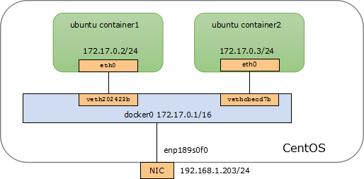

*********************
性能差异与调优
*********************

绑核：容器 iperf3
=====================

在Intel和Kunpeng平台上运行程序时，可能会遇到性能差差异，很多时候是因为Kunpeng上或者说ARM上程序总是在核间迁移造成的，
这个时候需要进行绑核操作。

这里以docker为例，使用iperf3测试两个容器在同一台主机上的网络带宽。模型如下：

|docker_two_container|

这里准备两台设备：

Kunpeng 920 配置
-----------------

.. code-block:: ini

    CPU            : Kunpeng 920-6426 2600MHz
    CPU Core       : 128
    Memory         : Samsung 2666 MT/s 32 GB * 16

    Host OS        : CentOS Linux release 7.7.1908 (AltArch)
    docker         : 19.03.8
    Container Image: Ubuntu 18.04.4 LTS
    iperf3         : 3.1.3

Intel 6248 配置
-----------------

.. code-block:: ini

    CPU            : Intel(R) Xeon(R) Gold 6248 CPU @ 2.50GHz
    CPU Core       : 80
    Memory         : Hynix 2666 MT/s 32 GB * 16

    Host OS        : CentOS Linux release 7.7.1908
    docker         : 19.03.7
    Container Image: Ubuntu 18.04.4 LTS
    iperf3         : 3.1.3

启动容器，不做任何特殊配置

.. code-block:: shell

    docker run -itd --name container1 ubuntu /bin/bash
    docker run -itd --name container2 ubuntu /bin/bash

两台设备设置一样

.. code-block:: console

    [user1@localhost ~]$ brctl show
    bridge name     bridge id               STP enabled     interfaces
    docker0         8000.024257803194       no              vetha6c37c1
                                                            vethe61f5c0
    virbr0          8000.5254003110e8       yes             virbr0-nic
    [user1@localhost ~]$ docker ps
    CONTAINER ID        IMAGE     COMMAND       CREATED      STATUS       PORTS  NAMES
    a51cac518006        ubuntu    "/bin/bash"   2 hours ago  Up 2 hours          container2
    1726251481ee        ubuntu    "/bin/bash"   2 hours ago  Up 2 hours          container1

Kunpeng 13~35Gbit/s
----------------------------------------

Kunpeng 测试结果在13~35Gbit/s之间浮动，表现稳定

.. code-block:: console

   root@1726251481ee:/# iperf3 -c 172.17.0.3 -t 3000
   Connecting to host 172.17.0.3, port 5201
   [  4] local 172.17.0.2 port 35342 connected to 172.17.0.3 port 5201
   [ ID] Interval           Transfer     Bandwidth       Retr  Cwnd
   [  4]   0.00-1.00   sec  4.06 GBytes  34.9 Gbits/sec  1008   1011 KBytes
   [  4]   1.00-2.00   sec  4.06 GBytes  34.9 Gbits/sec    4   1.07 MBytes
   [  4]   2.00-3.00   sec  4.02 GBytes  34.5 Gbits/sec    6   1.15 MBytes
   [  4]   3.00-4.00   sec  4.04 GBytes  34.7 Gbits/sec    0   1.21 MBytes
   [  4]   4.00-5.00   sec  4.02 GBytes  34.5 Gbits/sec    0   1.29 MBytes
   [  4]   5.00-6.00   sec  4.02 GBytes  34.5 Gbits/sec    0   1.37 MBytes
   [  4]   6.00-7.00   sec  4.04 GBytes  34.7 Gbits/sec    0   1.42 MBytes
   [  4]   7.00-8.00   sec  4.09 GBytes  35.1 Gbits/sec    0   1.47 MBytes
   [  4]   8.00-9.00   sec  3.57 GBytes  30.7 Gbits/sec    0   1.53 MBytes
   [  4]   9.00-10.00  sec  2.33 GBytes  20.0 Gbits/sec    0   1.57 MBytes
   [  4]  10.00-11.00  sec  1.60 GBytes  13.8 Gbits/sec   90   1.22 MBytes
   [  4]  11.00-12.00  sec  2.42 GBytes  20.8 Gbits/sec    0   1.32 MBytes
   [  4]  12.00-13.00  sec  1.92 GBytes  16.5 Gbits/sec    0   1.40 MBytes
   [  4]  13.00-14.00  sec  1.66 GBytes  14.2 Gbits/sec    0   1.47 MBytes
   [  4]  14.00-15.00  sec  1.84 GBytes  15.8 Gbits/sec    0   1.51 MBytes
   [  4]  15.00-16.00  sec  1.79 GBytes  15.4 Gbits/sec    0   1.54 MBytes
   [  4]  16.00-17.00  sec  3.59 GBytes  30.9 Gbits/sec   91   1.12 MBytes
   [  4]  17.00-18.00  sec  4.12 GBytes  35.4 Gbits/sec   45    899 KBytes
   [  4]  18.00-19.00  sec  4.14 GBytes  35.5 Gbits/sec    0    994 KBytes
   [  4]  19.00-20.00  sec  4.11 GBytes  35.3 Gbits/sec    0   1.06 MBytes
   [  4]  20.00-21.00  sec  4.15 GBytes  35.7 Gbits/sec    0   1.12 MBytes
   [  4]  21.00-22.00  sec  4.15 GBytes  35.7 Gbits/sec    0   1.19 MBytes

Intel 25Gbit/s
------------------------------------

Intel的测试结果稳定在25Gbit/s左右

.. code-block:: console

    root@3c7da2e893b8:/# iperf3 -c 172.17.0.2 -t 3000
    Connecting to host 172.17.0.2, port 5201
    [  4] local 172.17.0.3 port 48094 connected to 172.17.0.2 port 5201
    [ ID] Interval           Transfer     Bandwidth       Retr  Cwnd
    [  4]   0.00-1.00   sec  2.50 GBytes  21.5 Gbits/sec  135    321 KBytes
    [  4]   1.00-2.00   sec  2.94 GBytes  25.3 Gbits/sec    0    321 KBytes
    [  4]   2.00-3.00   sec  2.95 GBytes  25.4 Gbits/sec    0    321 KBytes
    [  4]   3.00-4.00   sec  2.95 GBytes  25.3 Gbits/sec    0    321 KBytes
    [  4]   4.00-5.00   sec  2.95 GBytes  25.3 Gbits/sec    0    321 KBytes
    [  4]   5.00-6.00   sec  2.63 GBytes  22.6 Gbits/sec  631    230 KBytes
    [  4]   6.00-7.00   sec  2.67 GBytes  23.0 Gbits/sec    0    232 KBytes
    [  4]   7.00-8.00   sec  2.85 GBytes  24.5 Gbits/sec    0    341 KBytes
    [  4]   8.00-9.00   sec  2.88 GBytes  24.8 Gbits/sec    0    341 KBytes
    [  4]   9.00-10.00  sec  2.79 GBytes  24.0 Gbits/sec    0    345 KBytes
    [  4]  10.00-11.00  sec  2.96 GBytes  25.4 Gbits/sec    0    345 KBytes
    [  4]  11.00-12.00  sec  2.87 GBytes  24.6 Gbits/sec    0    352 KBytes
    [  4]  12.00-13.00  sec  2.84 GBytes  24.4 Gbits/sec    0    361 KBytes
    [  4]  13.00-14.00  sec  2.68 GBytes  23.0 Gbits/sec  532    221 KBytes
    [  4]  14.00-15.00  sec  2.61 GBytes  22.4 Gbits/sec    0    221 KBytes
    [  4]  15.00-16.00  sec  2.66 GBytes  22.8 Gbits/sec    0    376 KBytes
    [  4]  16.00-17.00  sec  2.63 GBytes  22.6 Gbits/sec    0    376 KBytes
    [  4]  17.00-18.00  sec  2.75 GBytes  23.7 Gbits/sec    0    376 KBytes
    [  4]  18.00-19.00  sec  2.46 GBytes  21.1 Gbits/sec    0    376 KBytes
    [  4]  19.00-20.00  sec  2.96 GBytes  25.4 Gbits/sec    0    376 KBytes
    [  4]  20.00-21.00  sec  2.51 GBytes  21.5 Gbits/sec    0    376 KBytes
    [  4]  21.00-22.00  sec  2.87 GBytes  24.7 Gbits/sec    0    376 KBytes
    [  4]  22.00-23.00  sec  2.80 GBytes  24.0 Gbits/sec    0    400 KBytes
    [  4]  23.00-24.00  sec  2.88 GBytes  24.7 Gbits/sec    0    403 KBytes
    [  4]  24.00-25.00  sec  2.85 GBytes  24.5 Gbits/sec  125    290 KBytes

原因分析： iperf3的进程在Kunpeng上频繁核间迁移，在intel上较固定
---------------------------------------------------------------

.. code-block:: console
    :caption: Kunpeng

    1  [               0.0%]   33 [               0.0%]   65 [               0.0%]   97 [               0.0%]
    2  [||             2.6%]   34 [               0.0%]   66 [               0.0%]   98 [               0.0%]
    3  [|              1.3%]   35 [               0.0%]   67 [               0.0%]   99 [               0.0%]
    4  [               0.0%]   36 [               0.0%]   68 [               0.0%]   100[               0.0%]
    5  [||||||        31.0%]   37 [               0.0%]   69 [               0.0%]   101[               0.0%]
    6  [|||||||||||   51.9%]   38 [               0.0%]   70 [               0.0%]   102[               0.0%]
    7  [|||           11.0%]   39 [               0.0%]   71 [               0.0%]   103[               0.0%]
    8  [               0.0%]   40 [               0.0%]   72 [               0.0%]   104[               0.0%]
    9  [               0.0%]   41 [               0.0%]   73 [               0.0%]   105[               0.0%]
    10 [               0.0%]   42 [               0.0%]   74 [               0.0%]   106[               0.0%]
    11 [               0.0%]   43 [               0.0%]   75 [               0.0%]   107[               0.0%]
    12 [               0.0%]   44 [               0.0%]   76 [               0.0%]   108[               0.0%]
    13 [               0.0%]   45 [               0.0%]   77 [               0.0%]   109[               0.0%]
    14 [               0.0%]   46 [               0.0%]   78 [               0.0%]   110[               0.0%]
    15 [               0.0%]   47 [               0.0%]   79 [               0.0%]   111[               0.0%]
    16 [               0.0%]   48 [               0.0%]   80 [               0.0%]   112[               0.0%]
    17 [               0.0%]   49 [               0.0%]   81 [               0.0%]   113[               0.0%]
    18 [               0.0%]   50 [               0.0%]   82 [               0.0%]   114[               0.0%]
    19 [               0.0%]   51 [               0.0%]   83 [               0.0%]   115[               0.0%]
    20 [               0.0%]   52 [               0.0%]   84 [               0.0%]   116[               0.0%]
    21 [               0.0%]   53 [               0.0%]   85 [               0.0%]   117[               0.0%]
    22 [               0.0%]   54 [               0.0%]   86 [|||||||       32.9%]   118[               0.0%]
    23 [               0.0%]   55 [               0.0%]   87 [|||            6.5%]   119[               0.0%]
    24 [               0.0%]   56 [               0.0%]   88 [||||          18.8%]   120[               0.0%]
    25 [               0.0%]   57 [               0.0%]   89 [|              3.2%]   121[               0.0%]
    26 [               0.0%]   58 [               0.0%]   90 [|              3.3%]   122[               0.0%]
    27 [               0.0%]   59 [               0.0%]   91 [||||||        31.2%]   123[               0.0%]
    28 [               0.0%]   60 [               0.0%]   92 [|              2.6%]   124[               0.0%]
    29 [               0.0%]   61 [               0.0%]   93 [               0.0%]   125[               0.0%]
    30 [               0.0%]   62 [               0.0%]   94 [               0.0%]   126[               0.0%]
    31 [               0.0%]   63 [               0.0%]   95 [               0.0%]   127[               0.0%]
    32 [               0.0%]   64 [               0.0%]   96 [               0.0%]   128[               0.0%]
    Mem[||||                                11.6G/511G]   Tasks: 64, 288 thr; 3 running
    Swp[                                      0K/4.00G]   Load average: 1.01 0.53 0.36

.. code-block:: console
    :caption: Intel

    1  [|           4.7%]   21 [||||||||||100.0%]   41 [            0.0%]   61 [            0.0%]
    2  [            0.0%]   22 [|||||||||||90.0%]   42 [            0.0%]   62 [            0.0%]
    3  [            0.0%]   23 [            0.0%]   43 [            0.0%]   63 [||          2.0%]
    4  [            0.0%]   24 [            0.0%]   44 [            0.0%]   64 [            0.0%]
    5  [            0.0%]   25 [            0.0%]   45 [            0.0%]   65 [            0.0%]
    6  [            0.0%]   26 [            0.0%]   46 [            0.0%]   66 [            0.0%]
    7  [            0.0%]   27 [            0.0%]   47 [            0.0%]   67 [            0.0%]
    8  [            0.0%]   28 [            0.0%]   48 [            0.0%]   68 [            0.0%]
    9  [            0.0%]   29 [            0.0%]   49 [            0.0%]   69 [            0.0%]
    10 [            0.0%]   30 [            0.0%]   50 [            0.0%]   70 [            0.0%]
    11 [            0.0%]   31 [            0.0%]   51 [            0.0%]   71 [            0.0%]
    12 [            0.0%]   32 [|           0.6%]   52 [            0.0%]   72 [            0.0%]
    13 [            0.0%]   33 [            0.0%]   53 [            0.0%]   73 [            0.0%]
    14 [            0.0%]   34 [            0.0%]   54 [            0.0%]   74 [            0.0%]
    15 [            0.0%]   35 [|           0.6%]   55 [            0.0%]   75 [            0.0%]
    16 [            0.0%]   36 [            0.0%]   56 [            0.0%]   76 [            0.0%]
    17 [            0.0%]   37 [            0.0%]   57 [            0.0%]   77 [            0.0%]
    18 [            0.0%]   38 [            0.0%]   58 [            0.0%]   78 [            0.0%]
    19 [            0.0%]   39 [            0.0%]   59 [            0.0%]   79 [            0.0%]
    20 [            0.0%]   40 [            0.0%]   60 [            0.0%]   80 [            0.0%]
    Mem[|||                           4.62G/503G]   Tasks: 69, 337 thr; 3 running
    Swp[                                0K/4.00G]   Load average: 0.39 0.15 0.14
                                                    Uptime: 1 day, 02:20:37

在Kunpengs进行绑核操作后测试， 结果稳定在35Gbit/s左右

.. code-block:: shell

    taskset -cp 0 33802
    taskset -cp 1 33022

.. code-block:: console

    [root@localhost user1]# taskset -cp 0 39081
    pid 39081's current affinity list: 0-127
    pid 39081's new affinity list: 0
    [root@localhost user1]# taskset -cp 1 39082
    pid 39082's current affinity list: 0
    pid 39082's new affinity list: 1
    [root@localhost user1]#

.. code-block:: console

    [  4] 149.00-150.00 sec  4.06 GBytes  34.8 Gbits/sec    0   3.00 MBytes
    [  4] 150.00-151.00 sec  4.04 GBytes  34.7 Gbits/sec    0   3.00 MBytes
    [  4] 151.00-152.00 sec  4.07 GBytes  35.0 Gbits/sec    0   3.00 MBytes
    [  4] 152.00-153.00 sec  4.10 GBytes  35.2 Gbits/sec    0   3.00 MBytes
    [  4] 153.00-154.00 sec  4.08 GBytes  35.0 Gbits/sec    0   3.00 MBytes
    [  4] 154.00-155.00 sec  4.07 GBytes  35.0 Gbits/sec    0   3.00 MBytes
    [  4] 155.00-156.00 sec  4.09 GBytes  35.1 Gbits/sec    0   3.00 MBytes
    [  4] 156.00-157.00 sec  3.91 GBytes  33.6 Gbits/sec    0   3.00 MBytes
    [  4] 157.00-158.00 sec  4.06 GBytes  34.8 Gbits/sec    0   3.00 MBytes
    [  4] 158.00-159.00 sec  4.07 GBytes  35.0 Gbits/sec    0   3.00 MBytes
    [  4] 159.00-160.00 sec  4.07 GBytes  34.9 Gbits/sec    0   3.00 MBytes
    [  4] 160.00-161.00 sec  4.08 GBytes  35.0 Gbits/sec    0   3.00 MBytes
    [  4] 161.00-162.00 sec  4.09 GBytes  35.2 Gbits/sec    0   3.00 MBytes
    [  4] 162.00-163.00 sec  4.06 GBytes  34.9 Gbits/sec    0   3.00 MBytes

.. todo::

    为什么Kunpeng的性能要比intel好

绑核：Ceph
=====================

建议OSD绑定到核网卡硬盘在一起的node上。 网卡核硬盘在那个node上，请查看 :ref:`where_is_nic_numa`

例如： 绑定到node2

.. code-block:: shell

    for osd_pid in $(pgrep ceph-osd); do taskset -acp 48-71 $osd_pid ;done
    for osd_pid in $(pgrep ceph-osd); do ps -o thcount $osd_pid ;done

